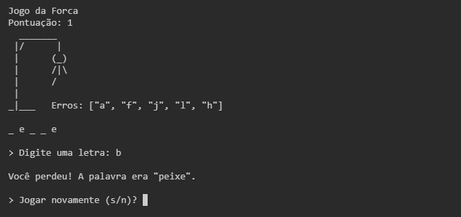

# Jogo da Forca

O jogo da forca é um jogo tradicional de adivinhação de palavras.

Regras:

- Uma palavra secreta é escolhida automaticamente pelo sistema;
- Para cada letra da palavra, desenham-se sublinhados que representam as letras;
- O jogador tenta adivinhar a palavra propondo letras, uma por vez;
- Se a letra estiver na palavra, ela é revelada nos espaços corretos;
- A cada erro, desenha-se uma parte de uma forca com um boneco (cabeça, corpo, braços e pernas). A **derrota** acontece quando o desenho da forca fica completo sem que a palavra seja descoberta;
- A **vitória** acontece quando todas as letras são adivinhadas antes do boneco ser completado;
- O **sistema de pontuação** funciona assim: a cada palavra acertada, soma-se +1 ponto. Em caso de derrota, a pontuação é zerada.

> Para iniciar o jogo, utilize `./bin/start.rb` no terminal.
