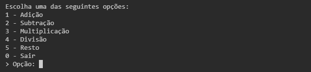

# Calculadora Simples

Este é um aplicativo de calculadora simples desenvolvido em Ruby puro, executado via terminal (CMD). Ele exibe um menu interativo com opções numéricas que permitem ao usuário realizar operações básicas de matemática: adição, subtração, multiplicação, divisão e cálculo de resto. Ao escolher uma das opções, o usuário informa os dois números desejados e o resultado é exibido imediatamente. A opção "0" encerra o programa.

